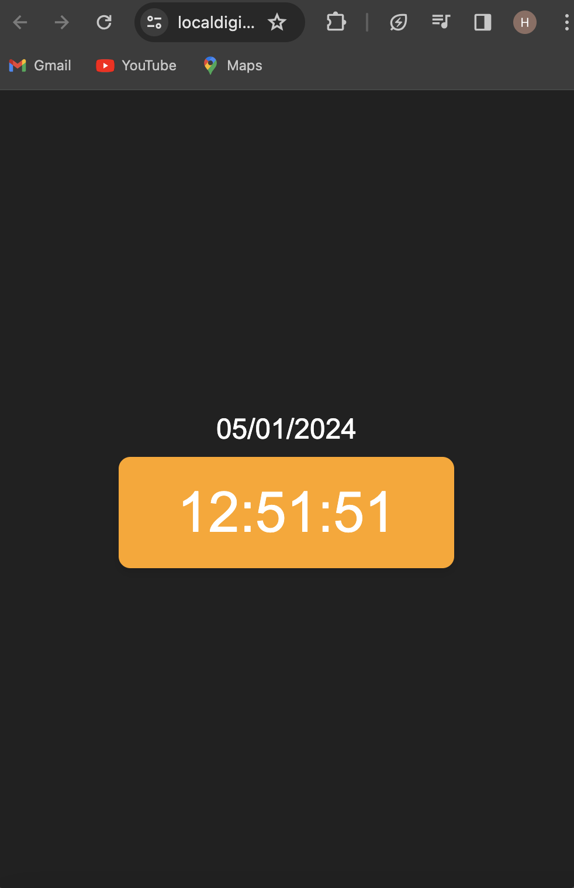

### Local Digital Clock

### Demo :



### You can Check it Live on Below Link :

[Live Link !](https://localdigitalclockjs.netlify.app/)

### Introduction : 

The Local Digital Clock is a web application designed to display the current time of the user's local system in a visually appealing manner. This project provides a simple and customizable digital clock that users can easily integrate into their websites or use individually.


### Features
- Real-time Clock Display: The application shows the current time, updating in real-time.

- Stylish Interface: A visually pleasing display with customization options.

### Technologies Used
- Frontend: HTML, CSS, JavaScript
- Deployment: Netlify


### Installation
1. Clone the repository:

```
git clone https://github.com/your-username/local-digital-clock.git


```

2. Navigate to the project directory:

```
cd local-digital-clock


```

3. Open the index.html file in a web browser.


### Usage

1. Open the Local Digital Clock in a web browser.
2. The current time of your local system will be displayed in a visually appealing digital format


### Customization 

Users can customize the appearance of the clock by modifying the styles in the style.css file. Adjust the colors, fonts, and other properties to match your website or personal preferences


### Contributing

If you would like to contribute to the project, follow these steps:

1. Fork the repository.
2. Create a new branch for your feature or bug fix.
3. Make changes and submit a pull request.